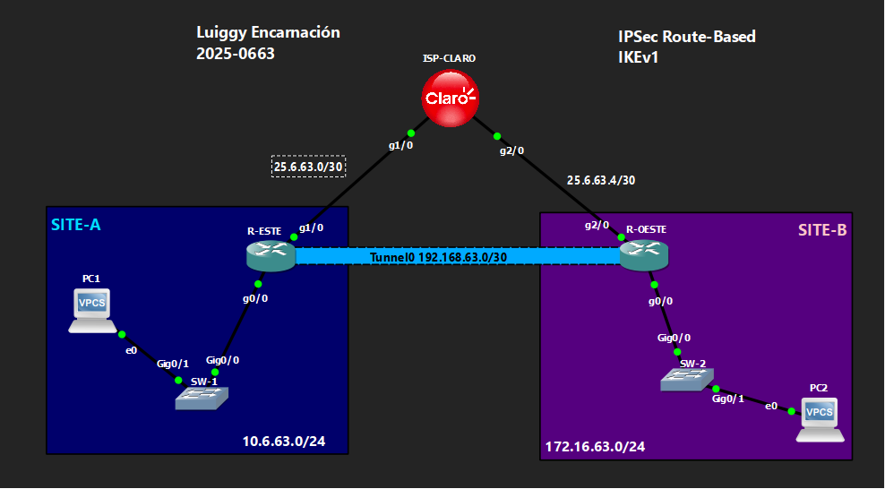

# 🔒 VPN Site-to-Site IPSec Route-Based — IKEv1
 
**Luiggy Habraham Encarnación Cabrera · Matrícula 2025-0663**
 


-8A2BE2?style=for-the-badge)


> VPN site-to-site IPSec basada en rutas (VTI) con IKEv1: el cifrado lo decide la tabla de enrutamiento, no una ACL.

---

## 📑 Tabla de Contenido

1. [Objetivo del Laboratorio](#-objetivo-del-laboratorio)
2. [Parámetros Usados](#-parámetros-usados)
3. [Documentación de la Red](#️-documentación-de-la-red)
4. [Funcionamiento de la VPN](#-funcionamiento-de-la-vpn)
5. [Configuración](#-configuración)
6. [Verificación](#-verificación)
7. [Capturas de Pantalla](#-capturas-de-pantalla)
8. [Video de Demostración](#-video-de-demostración)

---

## 🎯 Objetivo del Laboratorio

Configurar una VPN site-to-site **IPSec basada en rutas (route-based / VTI - Virtual Tunnel Interface)** con **IKEv1**, usando una interfaz `Tunnel0` con `tunnel mode ipsec ipv4` en lugar de un `crypto map` sobre la WAN. El objetivo es mostrar cómo el modelo route-based simplifica la definición del tráfico interesante: es la **tabla de enrutamiento** la que decide qué tráfico entra al túnel.

---

## 🧩 Parámetros Usados

| Parámetro | Valor |
|---|---|
| Versión IKE | IKEv1 (ISAKMP) |
| Cifrado Fase 1 | AES 256 |
| Hash Fase 1 | SHA |
| Autenticación | Pre-shared key (`Luiggy20250663!`) |
| Grupo DH | 14 |
| Lifetime Fase 1 | 86400 s |
| Transform-set (Fase 2) | esp-aes 256 / esp-sha-hmac |
| Modo IPSec | Túnel |
| Modelo | Route-based (VTI): `crypto ipsec profile` + `tunnel mode ipsec ipv4` |
| Tráfico interesante | No hay ACL; lo decide la tabla de enrutamiento |
| Enrutamiento | Ruta estática hacia Tunnel0 |

---

## 🗺️ Documentación de la Red

### Topología



### Tabla de Direccionamiento

| Dispositivo | Interfaz | IP | Red |
|---|---|---|---|
| ISP-CLARO | g1/0 | 25.6.63.2/30 | Enlace hacia R-ESTE |
| ISP-CLARO | g2/0 | 25.6.63.5/30 | Enlace hacia R-OESTE |
| ISP-CLARO | Lo0 | 20.20.20.20/32 | Loopback de pruebas |
| R-ESTE | g1/0 (WAN) | 25.6.63.1/30 | Hacia ISP |
| R-ESTE | g0/0 (LAN) | 10.6.63.1/24 | SITE-A |
| R-ESTE | Tunnel0 | 192.168.63.1/30 | VTI |
| R-OESTE | g2/0 (WAN) | 25.6.63.6/30 | Hacia ISP |
| R-OESTE | g0/0 (LAN) | 172.16.63.1/24 | SITE-B |
| R-OESTE | Tunnel0 | 192.168.63.2/30 | VTI |

### Detalles del Entorno

| Parámetro | Valor |
|---|---|
| Emulador | GNS3 / Packet Tracer |
| Dispositivos Cisco | IOU / Router IOS |
| VLANs | VLAN 1 (default) en SW-1 y SW-2 |
| Sitios | SITE-A (10.6.63.0/24), SITE-B (172.16.63.0/24) |

---

## 🔬 Funcionamiento de la VPN

**Fase 1 (ISAKMP/IKEv1):**
- `crypto isakmp policy 10`: AES-256, SHA, pre-share, grupo DH 14.
- `crypto isakmp key` amarrada a la IP pública del peer.

**Fase 2 (IPSec) — con interfaz de túnel virtual (VTI):**
- `crypto ipsec profile VPN-PROFILE` reemplaza al `crypto map`: agrupa el transform-set y se aplica directamente sobre la interfaz de túnel con `tunnel protection ipsec profile VPN-PROFILE`.
- `interface Tunnel0` con `tunnel mode ipsec ipv4`: es una interfaz lógica real, participa en el enrutamiento como cualquier otra.
- No existe ninguna ACL de "tráfico interesante": el cifrado se activa por una **ruta estática** apuntando hacia el túnel.

**Ventaja frente al modelo policy-based:**
- Al ser una interfaz real, Tunnel0 sí podría soportar un protocolo de enrutamiento dinámico, y es más sencillo de mantener en topologías con múltiples subredes remotas.

---

## 🔧 Configuración

Ver archivo: `Configuración para VPN IPSec Route-Based IKEv1.txt`

---

## ✅ Verificación

```
show ip route
show crypto isakmp sa
show crypto ipsec sa
```

Se espera:
- `show ip route` → ruta estática hacia la LAN remota apuntando a `Tunnel0`.
- `show crypto isakmp sa` → estado **QM_IDLE**.
- `show crypto ipsec sa` → contadores de encaps/decaps incrementando.

---

## 📸 Capturas de Pantalla

```
evidencias/
├── 01_topologia.png
├── 02_crypto_isakmp_policy.png
├── 03_crypto_ipsec_profile_tunnel0.png
├── 04_show_ip_interface_brief.png
├── 05_show_ip_route.png
├── 06_show_crypto_isakmp_sa.png
├── 07_show_crypto_ipsec_sa.png
└── 08_ping_pc1_pc2.png
```

---

## 🎬 Video de Demostración

> 📺 **[Ver demostración en YouTube →](https://youtu.be/zqoZuOrbyUs)**
